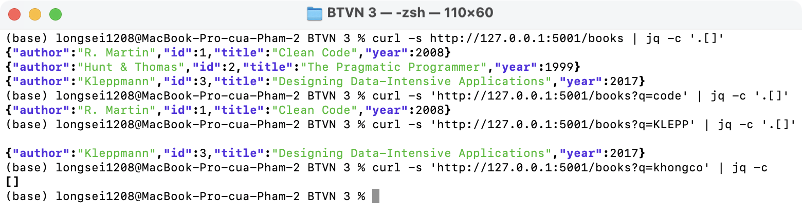
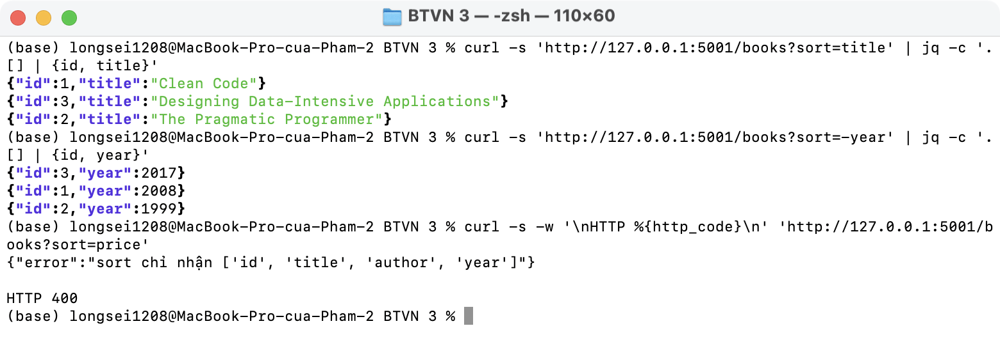
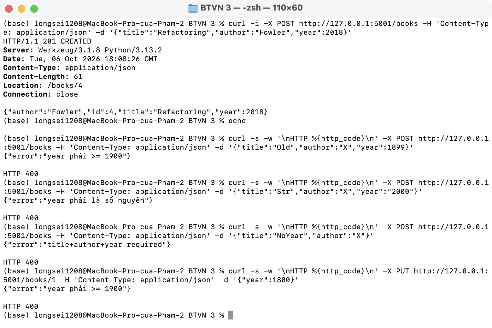
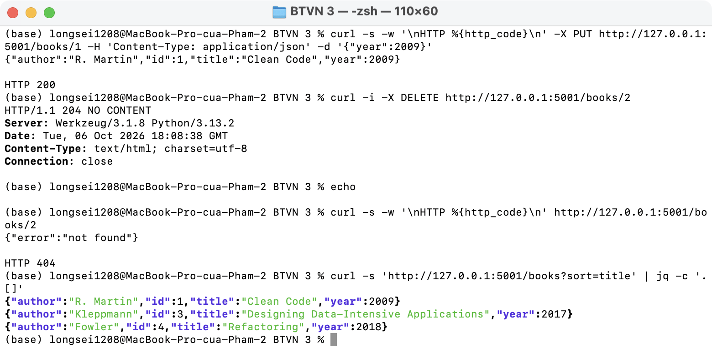
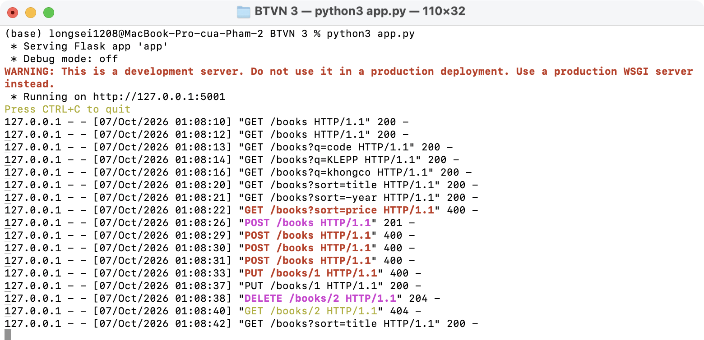

# BTVN 3 · Hoàn thiện bài 6 + mở rộng

- (a) Tìm kiếm: `GET /books?q=...` (theo title hoặc author, không phân biệt hoa thường)
- (b) Sort: `GET /books?sort=title`, thêm `-` để giảm dần (`?sort=-year`); field không hợp lệ → 400
- (c) `year` bắt buộc khi tạo, phải là số nguyên ≥ 1900 (kiểm tra cả khi `PUT`)

(a) Tìm kiếm:

(b) Sort:

(c) Validate `year`:

CRUD vẫn hoạt động:

