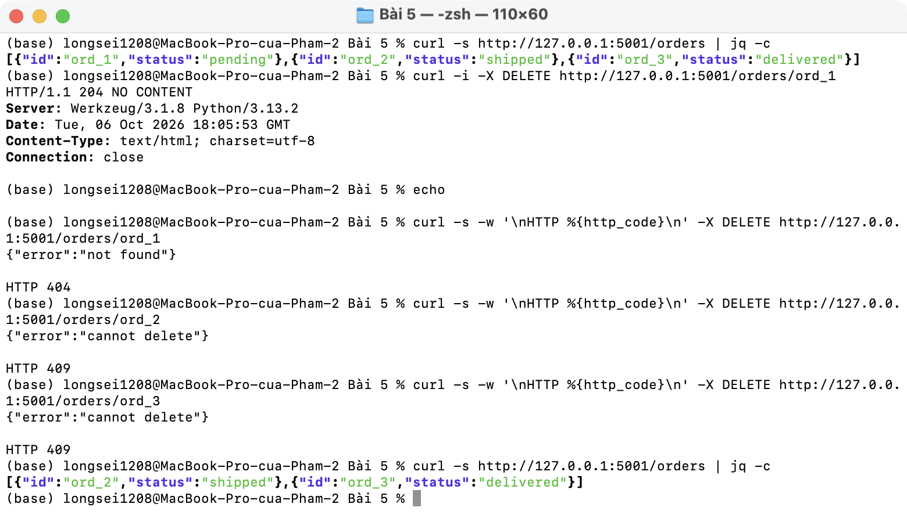
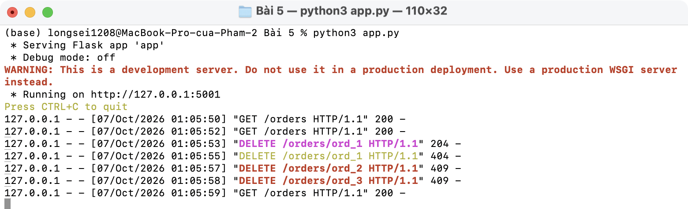

# Bài 5 · Status codes

`DELETE /orders/<order_id>`:

- `204` xoá thành công (không có body)
- `404` không tìm thấy
- `409` đơn đã `shipped` / `delivered` thì không được xoá

Code trên slide khai báo `/orders/<id>` nhưng hàm nhận `order_id` nên Flask báo lỗi. Ở đây đổi thành `/orders/<order_id>`.

