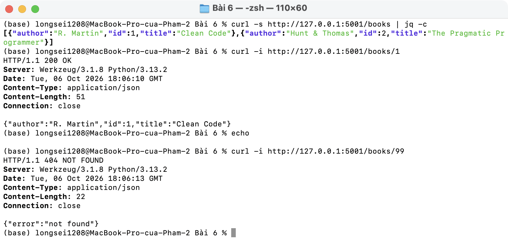
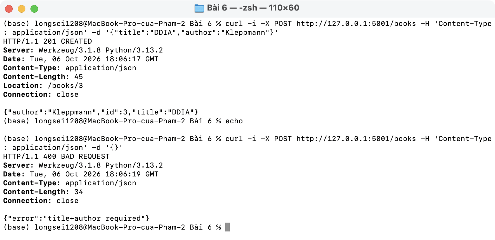
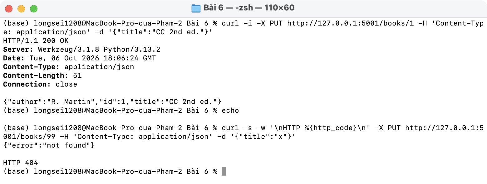
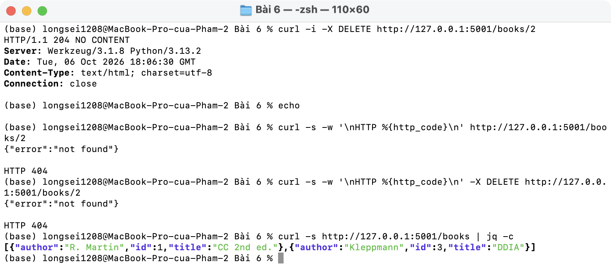
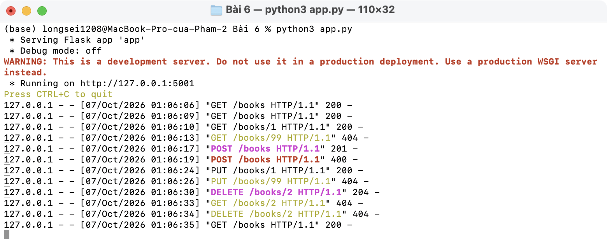

# Bài 6 · CRUD in-memory cho books

| Endpoint | Status |
| -------- | ------ |
| `GET /books` | 200 |
| `GET /books/<id>` | 200 / 404 |
| `POST /books` | 201 + `Location` / 400 |
| `PUT /books/<id>` | 200 / 404 |
| `DELETE /books/<id>` | 204 / 404 |

LIST + DETAIL:

CREATE (thiếu field → 400):

UPDATE:

DELETE:

