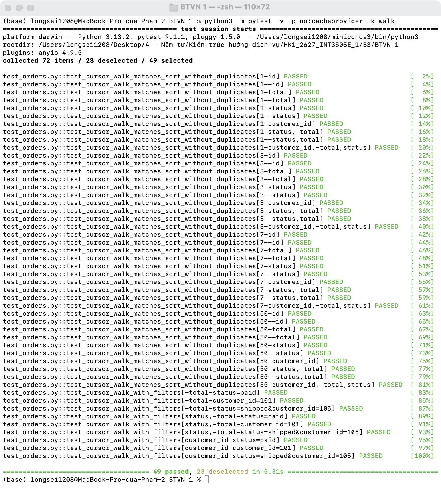
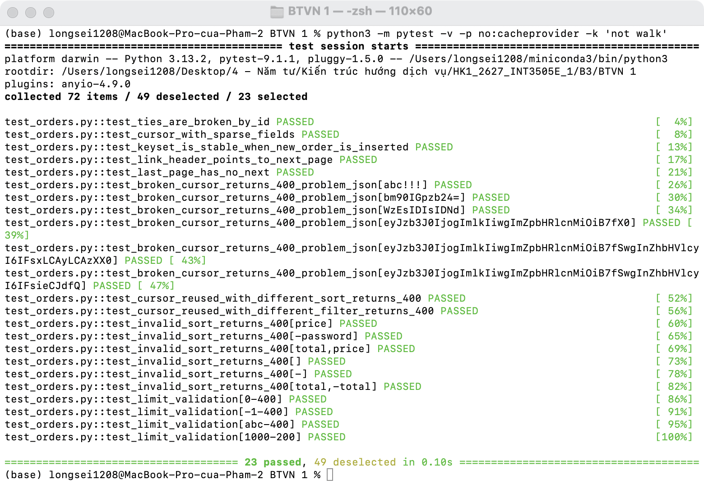
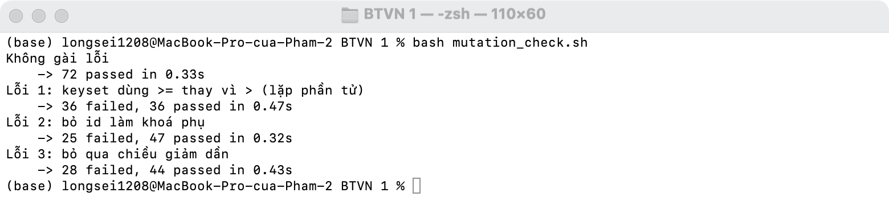
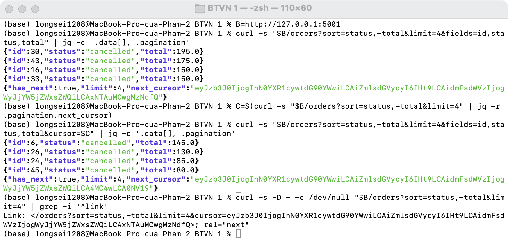
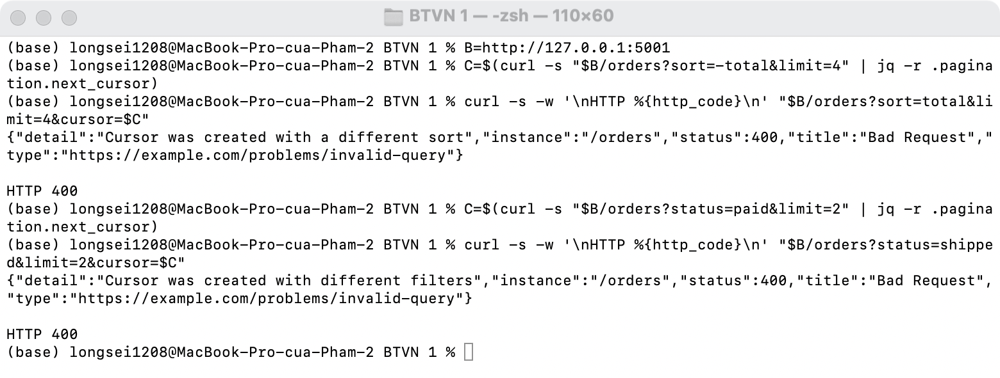

# BTVN 1 · Hoàn thiện `/orders` từ Lab 3, viết test cho cursor + sort

Hoàn thiện so với Lab 3 ([app.py](app.py)):

- Sort nhiều field: `sort=status,-total`
- Cursor gắn với cả sort lẫn filter: dùng lại cursor với sort/filter khác → 400
- Lỗi trả problem+json dùng chung `errors.py` từ Lab 2
- Header `Link: <...>; rel="next"`
- 50 order mẫu, `total` có nhiều giá trị trùng để kiểm tra khoá phụ `id`

Test: [test_orders.py](test_orders.py) (72 test, pytest + `app.test_client()`). [mutation_check.sh](mutation_check.sh) gài lỗi vào app để kiểm tra test có bắt được không.

## Kết quả chạy

Đi hết các trang bằng cursor với nhiều kiểu sort, `limit` và filter: không trùng, không sót, đúng thứ tự:

Các trường hợp còn lại: giá trị sort trùng nhau, sparse fieldsets, thêm dữ liệu giữa chừng, header `Link`, cursor hỏng, dùng lại cursor sai ngữ cảnh, sort / limit không hợp lệ:

Gài lỗi vào app thì test fail:

Chạy thật bằng curl: sort nhiều field + cursor + header `Link`:

Dùng lại cursor với sort / filter khác → 400:

