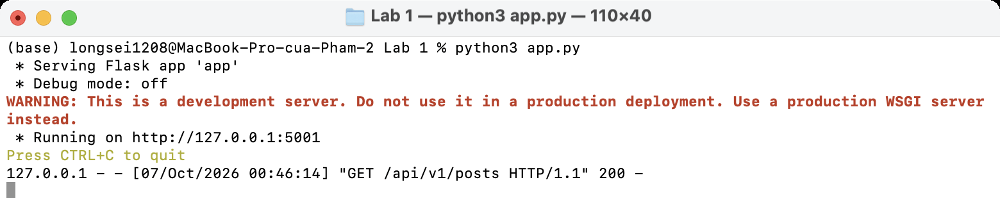
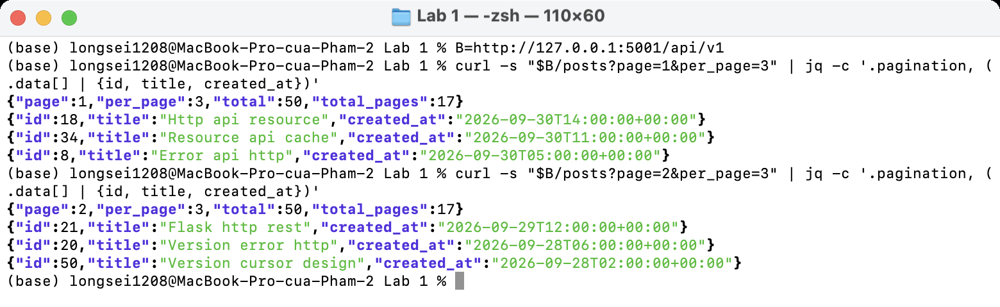
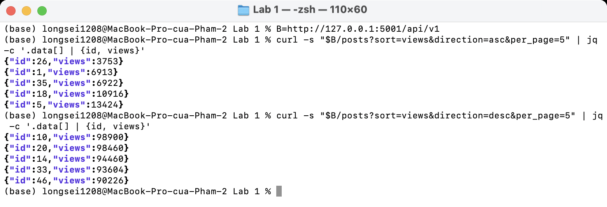
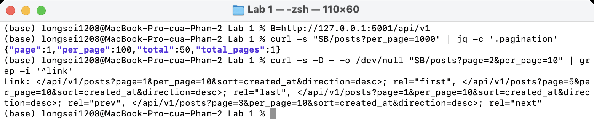
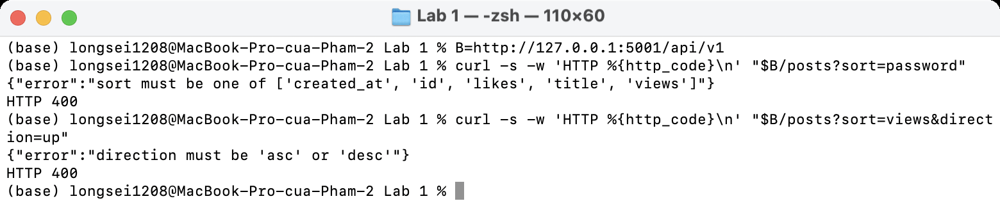
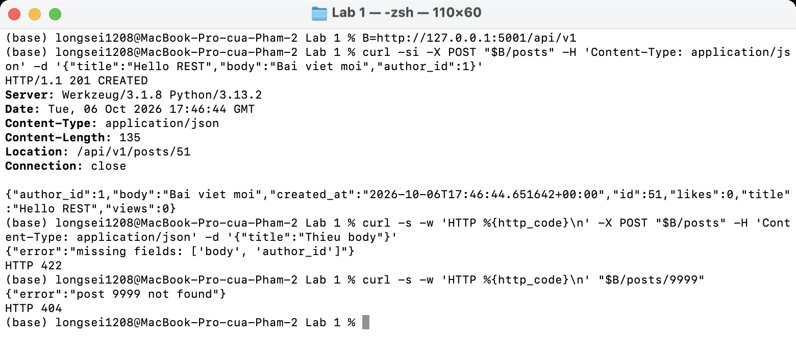
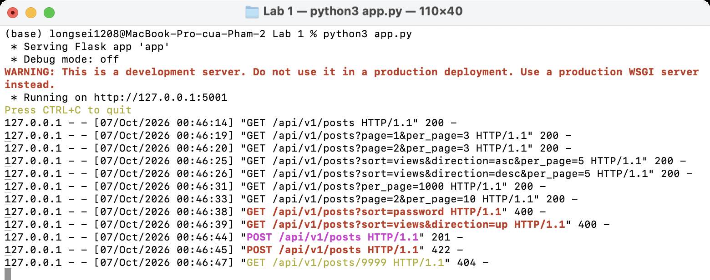

# Lab 1 · Thiết kế resource cho Blog API

**Bài toán:** Blog cho phép user đăng bài (posts), mỗi bài có bình luận (comments) và gắn thẻ (tags). Mỗi user có hồ sơ (profile) và theo dõi (follow) tác giả khác.

## 1. Resources trong miền

| Resource | Ý nghĩa |
| -------- | ------- |
| `users` | Người dùng |
| `profile` | Hồ sơ của một user (mỗi user có đúng 1) |
| `posts` | Bài viết, thuộc về 1 user (tác giả) |
| `comments` | Bình luận, thuộc về 1 post |
| `tags` | Thẻ, quan hệ nhiều-nhiều với posts |
| `followers` / `following` | Quan hệ theo dõi giữa các user |

## 2. Phân loại collection / item / sub-resource

| Resource | Collection | Item | Sub-resource |
| -------- | ---------- | ---- | ------------ |
| User | `/users` | `/users/{user_id}` | `/users/{user_id}/profile` (singleton) |
| Post | `/posts` | `/posts/{post_id}` | `/users/{user_id}/posts` (bài của một tác giả) |
| Comment | — | `/comments/{comment_id}` | `/posts/{post_id}/comments` |
| Tag | `/tags` | `/tags/{tag_id}` | `/posts/{post_id}/tags` |
| Follow | — | — | `/users/{user_id}/followers`, `/users/{user_id}/following` |

- Comment chỉ có nghĩa trong một post nên collection nằm dưới `/posts/{post_id}/comments`. Item vẫn có URL ngắn `/comments/{comment_id}` để endpoint không quá 3 cấp.
- Follow là quan hệ, không phải thực thể độc lập. Theo dõi = `PUT /users/{me}/following/{user_id}`, bỏ theo dõi = `DELETE` cùng URL (đều idempotent).

## 3. Sơ đồ cây endpoint + version segment

Version đặt ở **URL prefix `/api/v1`** ngay từ đầu (giống cách nhiều API công khai làm, dễ thấy, dễ route ở gateway).

```text
/api/v1
├── /users                          GET, POST
│   └── /{user_id}                  GET, PATCH, DELETE
│       ├── /profile                GET, PUT
│       ├── /posts                  GET
│       ├── /followers              GET
│       └── /following              GET
│           └── /{user_id}          PUT, DELETE
├── /posts                          GET, POST          ← triển khai trong app.py
│   └── /{post_id}                  GET, PUT, PATCH, DELETE
│       ├── /comments               GET, POST
│       └── /tags                   GET, POST
│           └── /{tag_id}           DELETE
├── /comments
│   └── /{comment_id}               GET, PATCH, DELETE
└── /tags                           GET, POST
    └── /{tag_id}                   GET, DELETE
```

## 4. Flask routes cho collection `/posts`

File [app.py](app.py) triển khai:

| Route | Mô tả |
| ----- | ----- |
| `GET /api/v1/posts` | Phân trang `page` (bắt đầu từ 1) + `per_page` (mặc định 20, tối đa 100); sort bằng `sort` + `direction` (asc/desc); trả header `Link` (first/last/prev/next) |
| `POST /api/v1/posts` | Tạo bài viết, trả `201 Created` + header `Location` |
| `GET /api/v1/posts/{post_id}` | Lấy một bài viết (để `Location` trỏ tới được) |

## Kết quả chạy

Server:



Phân trang `page` + `per_page` (trang 1 và trang 2 không trùng nhau):



Sort `views` tăng dần / giảm dần:



`per_page=1000` bị giới hạn về 100 và header `Link`:



Sort field không tồn tại / `direction` sai → 400:



`POST /posts` → 201 + `Location`; thiếu field → 422; không tìm thấy → 404:



Log server:


