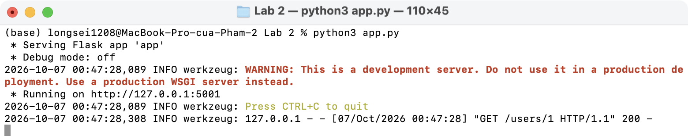
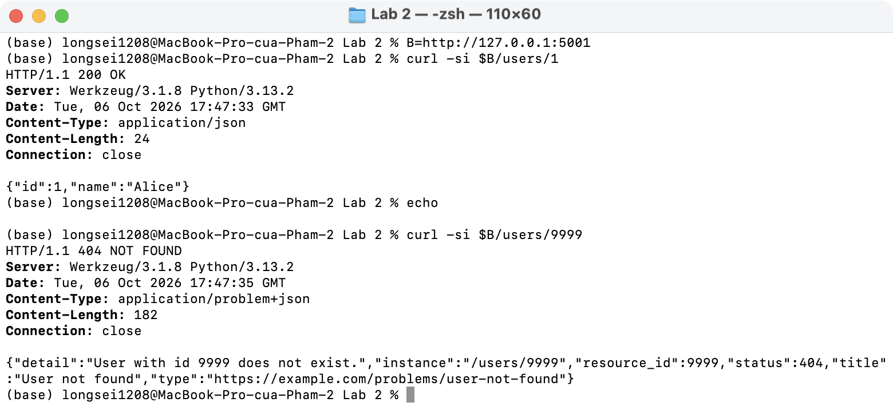
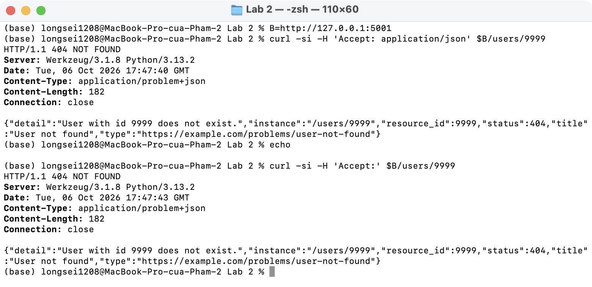
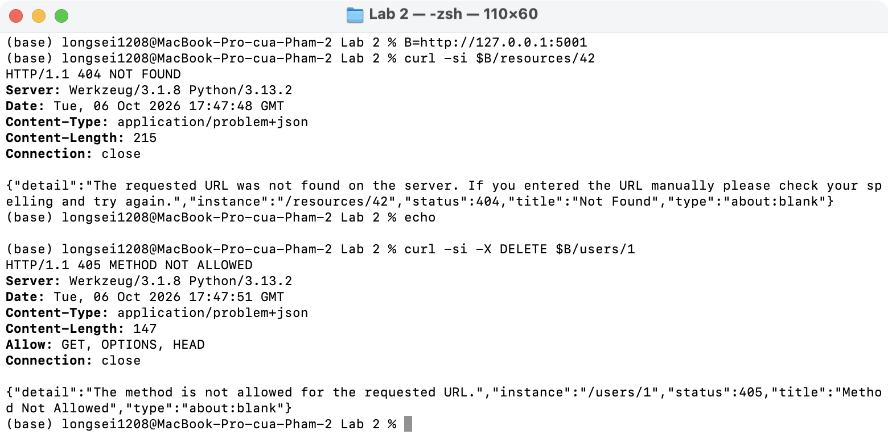
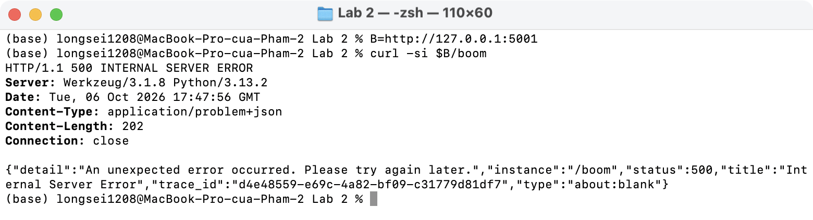
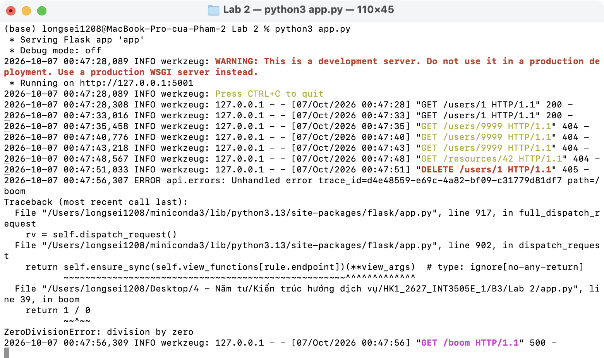

# Lab 2 · Error handler trả về problem+json

- [errors.py](errors.py): `ProblemError` + handler cho `ProblemError`, fallback `HTTPException`, và lỗi chưa bắt (500).
- [app.py](app.py): `GET /users/<id>` raise `ProblemError` khi không tìm thấy; `/boom` cố tình gây lỗi để thử 500.

## Kết quả chạy

Server:

`/users/1` → 200; `/users/9999` → 404 `application/problem+json` có đủ `type`, `title`, `status`, `detail`, `instance`:

`Accept: application/json` hoặc không gửi `Accept` vẫn nhận problem+json:

Fallback `HTTPException`: route không tồn tại `/resources/42` → 404, sai method → 405 kèm header `Allow`:

Lỗi chưa bắt → 500 với message trung tính, không lộ stack trace:

Stack trace chỉ nằm ở log server (tra bằng `trace_id`):

