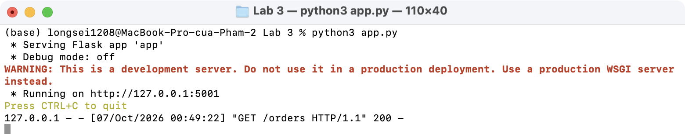
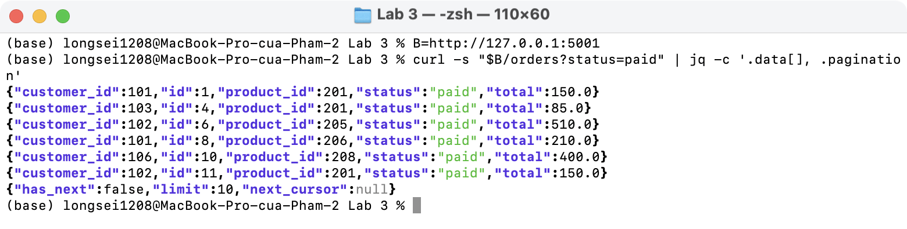
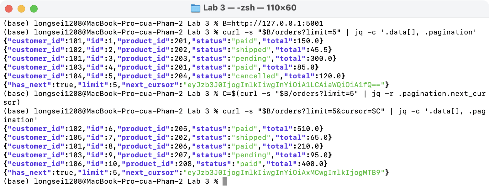
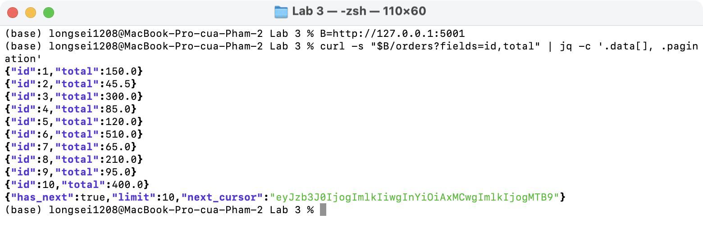
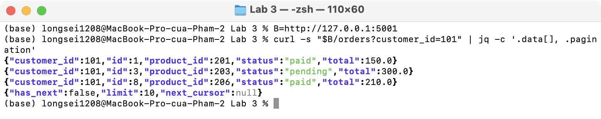
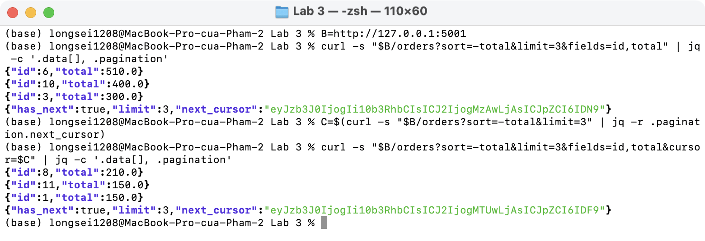
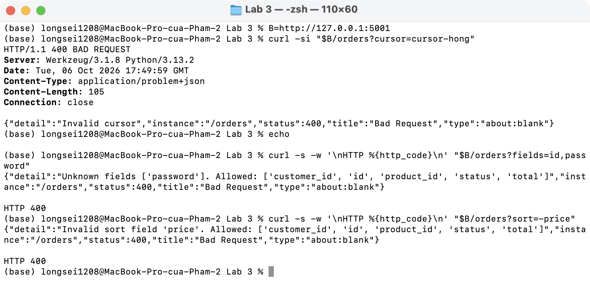
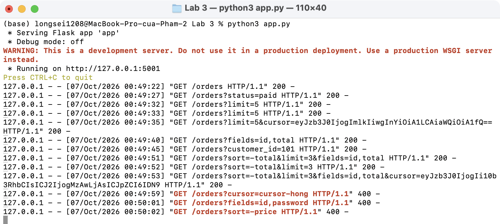

# Lab 3 · Triển khai `/orders` có cursor pagination

[app.py](app.py): `GET /orders` với (1) cursor, (2) filter `status`, `customer_id`, (3) sort (`sort=total`, `sort=-total`), (4) sparse fieldsets (`fields=id,total`). `limit` mặc định 10, tối đa 100.

Cursor là base64 của `{"sort", "v", "id"}` của phần tử cuối trang (keyset); `id` làm khoá phụ khi giá trị sort trùng nhau.

## Kết quả chạy

Server:

`?status=paid`:

`?limit=5` rồi sang trang sau bằng `next_cursor`:

`?fields=id,total`:

`?customer_id=101`:

`?sort=-total` + cursor (hai order cùng `total = 150` vẫn đúng thứ tự theo `id`):

Cursor hỏng, field không tồn tại, sort field không tồn tại → 400:

Log server:

